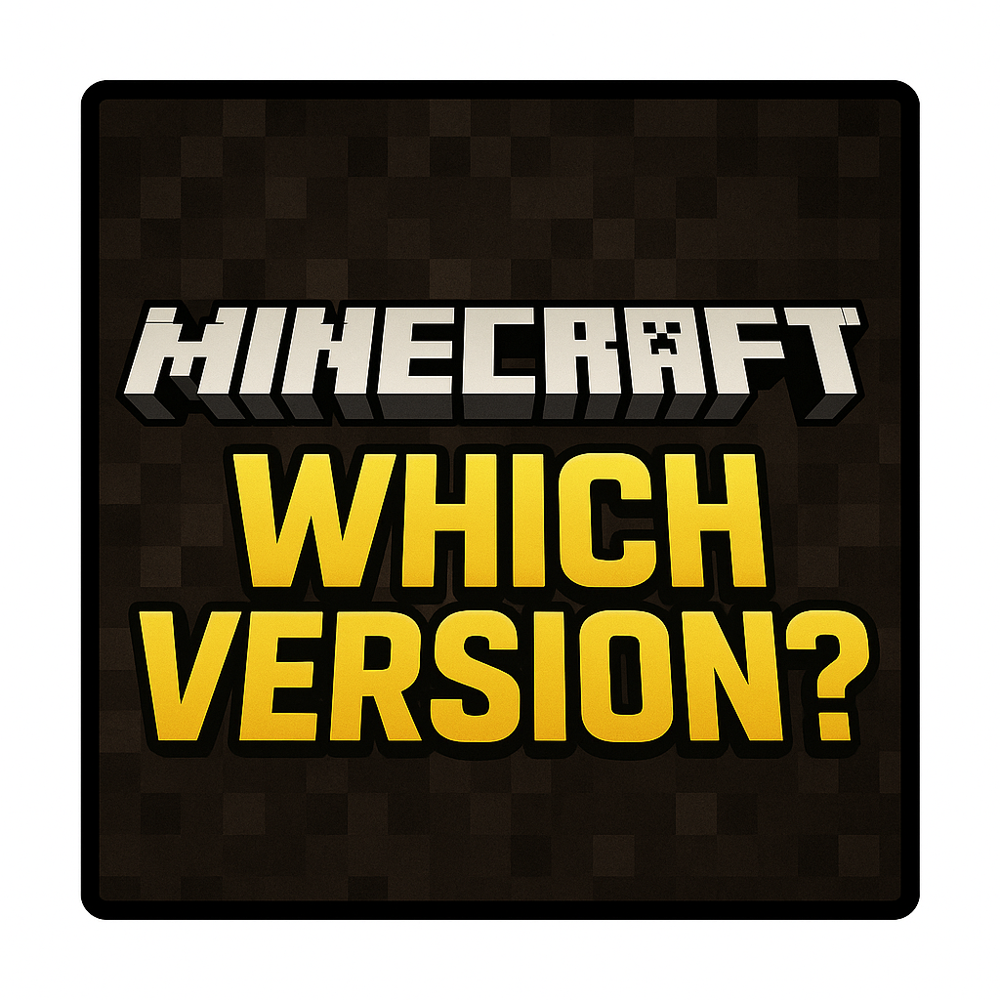

This is a client meme mod that adds these window titles to your game:

- "Minecraft 114.514",
- "Minecraft 2/3/4/5",
- "Minecraft blackwell",
- "Minecraft operation black ice",
- "Minecraft mojang is retarded",
- "Minecraft 26.2",
- "Minecraft MoForce 576.08",
- "Minecraft4™",
- "Minecraft CopperLake",
- "Minecraft i25-18900kx",
- "Minecraft 42.7.04",
- "Minecraft 0.114.5",
- "Minecraft CreateOS 1.0.114.6",
- "Minecraft 845",
- "Minecraft UI 12.5 Enhanced Edition",
- "Minecraft：第12话 我最好的史蒂夫",
- "Minecraft: 终",
- "Minecraft: It's MyGO!!!!!",
- "Minecraft KB5063878",
- "Minecraft Y16S1",
- "Minecraft 2025 Ver.CN1.14.5G",
- "Minecraft 9.9.25-114514",
- "Minecraft 1/2",
- "Minecraft Studio 581.57"

They will be selected randomly when window title is updated.

Configurable via whatversioning.json